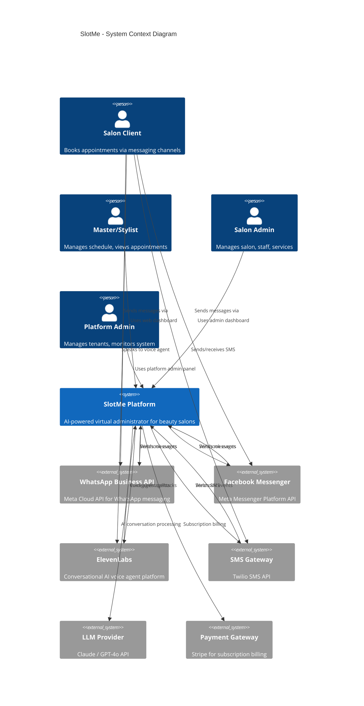
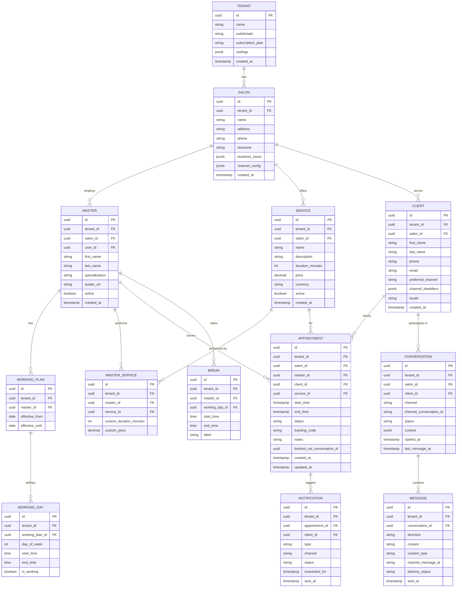

# SlotMe Architecture Document

> Multitenant Virtual Administrator for Beauty Salons
> Version: 1.0 | Date: 2026-02-07

---

## Table of Contents

1. [System Overview](#1-system-overview)
2. [Architecture Principles](#2-architecture-principles)
3. [Technology Stack](#3-technology-stack)
4. [System Context Diagram (C4 Level 1)](#4-system-context-diagram-c4-level-1)
5. [Container Diagram (C4 Level 2)](#5-container-diagram-c4-level-2)
6. [Component Architecture](#6-component-architecture)
7. [Data Architecture](#7-data-architecture)
8. [Integration Architecture](#8-integration-architecture)
9. [AI/Conversation Engine Architecture](#9-aiconversation-engine-architecture)
10. [Scheduling Engine](#10-scheduling-engine)
11. [Notification Architecture](#11-notification-architecture)
12. [Security Architecture](#12-security-architecture)
13. [Scalability and Performance](#13-scalability-and-performance)
14. [Deployment Architecture](#14-deployment-architecture)
15. [Technology Decision Records](#15-technology-decision-records)

---

## 1. System Overview

SlotMe is a **multitenant virtual administrator platform** designed for beauty salons. It acts as an AI-powered receptionist that handles all client communications, appointment bookings, calendar management, and proactive notifications across multiple communication channels.

### Core Capabilities

- **AI-Powered Conversational Booking**: Clients interact naturally via WhatsApp, Facebook Messenger, SMS, or voice to book, modify, or cancel appointments
- **Multi-Channel Communication**: Unified messaging layer abstracting WhatsApp Business API, Facebook Messenger, ElevenLabs Voice Agent, and SMS
- **Master Calendar Management**: Each stylist/master has an individual working plan with availability windows, breaks, and service durations
- **Smart Rearrangement**: When a client cancels, the system can proactively offer the freed slot to waitlisted clients or suggest rearrangements to optimize the schedule
- **Proactive Notifications**: Automated reminders for upcoming visits, confirmations, and follow-ups
- **Multi-Tenancy**: Each salon operates as an isolated tenant with its own staff, services, pricing, and client base

### Key Stakeholders

| Stakeholder | Role |
|---|---|
| Salon Owner/Admin | Manages salon settings, staff, services, and views analytics |
| Master/Stylist | Manages personal schedule, views appointments, handles cancellations |
| Client | Books appointments via messaging channels, receives reminders |
| Platform Admin | Manages tenants, monitors system health, billing |

---

## 2. Architecture Principles

| # | Principle | Rationale |
|---|---|---|
| AP-1 | **API-First Design** | All functionality exposed via well-defined REST/GraphQL APIs. Frontend and integrations consume the same API layer. |
| AP-2 | **Event-Driven Communication** | Internal services communicate via events for loose coupling, enabling independent scaling and deployment. |
| AP-3 | **Multi-Tenancy by Default** | Every data access path enforces tenant isolation. The tenant context is established at the gateway and propagated through the entire call chain. |
| AP-4 | **Channel Abstraction** | Messaging channels are abstracted behind a unified interface. Adding a new channel requires implementing an adapter, not modifying core logic. |
| AP-5 | **Cloud-Native and Container-First** | All services are designed as stateless containers, deployed via Kubernetes, and horizontally scalable. |
| AP-6 | **Convention Over Configuration** | Minimize boilerplate through framework conventions and sensible defaults. |
| AP-7 | **Security in Depth** | Authentication, authorization, data encryption, and tenant isolation enforced at every layer. |
| AP-8 | **Observability Built-In** | Structured logging, distributed tracing, and metrics are first-class concerns, not afterthoughts. |

---

## 3. Technology Stack

### 3.1 Backend

| Component | Technology | Justification |
|---|---|---|
| **Language** | Java 21+ | Mature ecosystem, strong typing, excellent tooling, large talent pool, virtual threads (Project Loom) for efficient concurrency |
| **Framework** | Quarkus 3.x | Cloud-native Java framework with fast startup (~0.5s), low memory footprint, native GraalVM compilation support, live coding in dev mode, and first-class Kubernetes integration. 85% reduction in CPU/memory vs traditional frameworks. |
| **Build Tool** | Maven | Industry standard for Java, extensive plugin ecosystem |
| **API Style** | REST (JAX-RS) + GraphQL (SmallRye GraphQL) | REST for external integrations and webhooks; GraphQL for flexible frontend queries |

### 3.2 Frontend

| Component | Technology | Justification |
|---|---|---|
| **Framework** | React 19 with TypeScript | Component-based architecture, large ecosystem, strong typing with TypeScript |
| **Build Tool** | Vite | Fast HMR, optimized builds, modern ESM-first approach |
| **UI Library** | Ant Design or Shadcn/UI + Tailwind CSS | Professional admin UI components with customizable design system |
| **State Management** | TanStack Query + Zustand | Server state caching with TanStack Query; lightweight client state with Zustand |
| **Calendar UI** | FullCalendar | Mature scheduling/calendar component with resource views, drag-and-drop, and extensive customization |

### 3.3 Database and Storage

| Component | Technology | Justification |
|---|---|---|
| **Primary Database** | PostgreSQL 16+ | Robust RDBMS with native JSON support, Row-Level Security for tenant isolation, excellent performance, and proven reliability at scale |
| **Caching** | Redis 7+ | In-memory cache for session data, conversation context, real-time availability lookups, and pub/sub for notifications |
| **Object Storage** | MinIO (self-hosted) / S3 (cloud) | Client photos, salon images, documents |
| **Search (future)** | Elasticsearch / OpenSearch | Full-text search across clients, services, appointment history |

### 3.4 Message Queue and Event Bus

| Component | Technology | Justification |
|---|---|---|
| **Event Bus** | Apache Kafka | High-throughput, durable event streaming for appointment events, notifications, and audit trail. Supports event replay for debugging and recovery. |
| **Task Queue** | Redis Streams | Lightweight task queue for scheduled notifications, reminders, and deferred processing. Leverages existing Redis infrastructure. |

### 3.5 AI and LLM

| Component | Technology | Justification |
|---|---|---|
| **Primary LLM** | Claude (Anthropic) via API | Strong conversational abilities, excellent tool-use/function-calling, context retention across long conversations, competitive pricing |
| **Fallback LLM** | OpenAI GPT-4o | Widely available, proven appointment booking capabilities, strong multilingual support |
| **Voice AI** | ElevenLabs Conversational AI 2.0 | Sub-100ms latency, 32+ languages, natural turn-taking, emotion detection, 400+ pre-built integrations |
| **Embeddings** | Sentence Transformers (local) or OpenAI Embeddings | For semantic search across services and FAQ knowledge bases per salon |

### 3.6 Cloud Infrastructure

| Component | Technology | Justification |
|---|---|---|
| **Container Orchestration** | Kubernetes (K8s) | Industry standard for container orchestration, auto-scaling, self-healing |
| **Cloud Provider** | AWS (primary) | Broadest service catalog, mature managed services (RDS, ElastiCache, MSK, EKS) |
| **CI/CD** | GitHub Actions | Native GitHub integration, extensive marketplace, cost-effective |
| **Container Registry** | GitHub Container Registry / Amazon ECR | Integrated with CI/CD pipeline |
| **DNS and CDN** | CloudFlare | DDoS protection, global CDN, edge caching for static assets |
| **Monitoring** | Grafana + Prometheus + Loki | Open-source observability stack with dashboards, alerting, and log aggregation |
| **Tracing** | OpenTelemetry + Jaeger | Distributed tracing across microservices |

---

## 4. System Context Diagram (C4 Level 1)



### System Context Description

- **Salon Clients** communicate with SlotMe through WhatsApp, Facebook Messenger, voice calls (ElevenLabs), or SMS. They never interact with the SlotMe platform directly -- the AI handles all conversational interactions.
- **Masters/Stylists** use a responsive web dashboard to view and manage their personal schedules, confirm appointments, and communicate with clients.
- **Salon Admins** use an admin dashboard to manage salon settings, staff profiles, services catalog, working hours, and view analytics.
- **Platform Admins** manage tenant provisioning, billing, system monitoring, and configuration.
- **External Systems** include messaging channel APIs, LLM providers for AI conversation, and payment gateways for SaaS billing.

---

## 5. Container Diagram (C4 Level 2)

```mermaid
C4Container
    title SlotMe - Container Diagram

    Person(client, "Salon Client")
    Person(master, "Master/Stylist")
    Person(admin, "Salon Admin")

    System_Boundary(slotme, "SlotMe Platform") {
        Container(apiGateway, "API Gateway", "Quarkus + Vert.x", "Routes requests, authenticates, resolves tenant context, rate limiting")
        Container(webApp, "Web Application", "React + TypeScript", "Admin and master dashboards, SPA served via CDN")
        Container(messagingService, "Messaging Service", "Quarkus", "Unified messaging abstraction, channel adapters, webhook handlers")
        Container(conversationEngine, "Conversation Engine", "Quarkus", "AI-powered conversation management, intent processing, context tracking")
        Container(schedulingService, "Scheduling Service", "Quarkus", "Availability calculation, conflict detection, appointment CRUD, rearrangement")
        Container(notificationService, "Notification Service", "Quarkus", "Event-driven notifications, reminders, scheduled message delivery")
        Container(tenantService, "Tenant Service", "Quarkus", "Tenant provisioning, configuration, subscription management")
        Container(userService, "User/Auth Service", "Quarkus + Keycloak", "Authentication, authorization, user management")

        ContainerDb(postgres, "PostgreSQL", "PostgreSQL 16", "Primary data store with RLS for tenant isolation")
        ContainerDb(redis, "Redis", "Redis 7", "Cache, session store, conversation context, task queue")
        ContainerDb(kafka, "Kafka", "Apache Kafka", "Event streaming, audit log, async communication")
    }

    System_Ext(whatsapp, "WhatsApp API")
    System_Ext(messenger, "Messenger API")
    System_Ext(elevenlabs, "ElevenLabs API")
    System_Ext(sms, "Twilio SMS")
    System_Ext(llm, "LLM API")

    Rel(client, whatsapp, "Messages")
    Rel(client, messenger, "Messages")
    Rel(client, elevenlabs, "Voice")
    Rel(client, sms, "SMS")
    Rel(master, webApp, "HTTPS")
    Rel(admin, webApp, "HTTPS")

    Rel(webApp, apiGateway, "REST/GraphQL over HTTPS")
    Rel(whatsapp, messagingService, "Webhooks")
    Rel(messenger, messagingService, "Webhooks")
    Rel(elevenlabs, conversationEngine, "Voice callbacks")
    Rel(sms, messagingService, "Webhooks")

    Rel(apiGateway, schedulingService, "gRPC/REST")
    Rel(apiGateway, tenantService, "gRPC/REST")
    Rel(apiGateway, userService, "gRPC/REST")

    Rel(messagingService, conversationEngine, "Internal API")
    Rel(conversationEngine, llm, "HTTPS")
    Rel(conversationEngine, schedulingService, "Internal API")
    Rel(schedulingService, kafka, "Publishes events")
    Rel(notificationService, kafka, "Consumes events")
    Rel(notificationService, messagingService, "Sends via channels")

    Rel(schedulingService, postgres, "JDBC")
    Rel(tenantService, postgres, "JDBC")
    Rel(userService, postgres, "JDBC")
    Rel(conversationEngine, redis, "Cache/Context")
    Rel(messagingService, redis, "Cache")
```



### Container Descriptions

| Container | Responsibility |
|---|---|
| **API Gateway** | Single entry point for all web/API traffic. Handles JWT validation, tenant context resolution (from subdomain or token), rate limiting, and request routing. Built on Quarkus with Vert.x for non-blocking I/O. |
| **Web Application** | React SPA providing dashboards for masters, salon admins, and platform admins. Served as static assets via CDN. Communicates with the backend exclusively through the API Gateway. |
| **Messaging Service** | Manages all inbound/outbound messaging across channels. Contains channel-specific adapters (WhatsApp, Messenger, SMS) that normalize messages into a unified internal format. Handles webhook verification, message queuing, and delivery status tracking. |
| **Conversation Engine** | Core AI service that processes normalized messages, maintains conversation context in Redis, calls the LLM for intent understanding and response generation, and orchestrates actions (booking, cancellation, rescheduling) by calling other services. |
| **Scheduling Service** | Manages all appointment lifecycle operations. Calculates real-time availability based on master working plans, existing bookings, and service durations. Detects conflicts and handles slot rearrangement logic. |
| **Notification Service** | Event-driven service consuming Kafka events (appointment created, cancelled, reminder due) and dispatching notifications through the Messaging Service. Manages scheduled jobs for reminders (e.g., 24h before appointment). |
| **Tenant Service** | Manages tenant lifecycle: provisioning, configuration, feature flags, and subscription/billing integration. |
| **User/Auth Service** | Handles authentication (OAuth2/OIDC via Keycloak), authorization (RBAC), user profile management for all user types (admins, masters, clients). |

---

## 6. Component Architecture

### 6.1 Messaging Service Components

```
messaging-service/
  adapters/
    WhatsAppAdapter        -- WhatsApp Cloud API integration (send/receive)
    MessengerAdapter       -- Facebook Messenger Platform integration
    SmsAdapter             -- Twilio SMS integration
    ElevenLabsAdapter      -- ElevenLabs voice agent webhook handler
  core/
    MessageRouter          -- Routes inbound messages to Conversation Engine
    MessageSender          -- Unified outbound message dispatch
    WebhookVerifier        -- Validates webhook signatures per channel
    DeliveryTracker        -- Tracks message delivery/read status
    MediaHandler           -- Processes images, audio, documents
  model/
    UnifiedMessage         -- Channel-agnostic message representation
    ChannelConfig          -- Per-tenant channel configuration
    DeliveryStatus         -- Delivery receipt model
```

### 6.2 Conversation Engine Components

```
conversation-engine/
  core/
    ConversationManager    -- Manages conversation lifecycle and state
    ContextStore           -- Redis-backed conversation context (history, slots, state)
    IntentProcessor        -- Orchestrates LLM calls for intent understanding
    ActionExecutor         -- Executes booking actions based on AI decisions
    ResponseGenerator      -- Formats AI responses for the target channel
  llm/
    LlmClient             -- Abstraction over LLM providers (Claude, GPT-4o)
    PromptBuilder          -- Builds system/user prompts with salon context
    ToolDefinitions        -- Function/tool definitions for LLM tool-use
    FallbackHandler        -- Handles LLM failures, switches to fallback provider
  tools/
    BookAppointmentTool    -- LLM tool: book an appointment
    CheckAvailabilityTool  -- LLM tool: query available slots
    CancelAppointmentTool  -- LLM tool: cancel existing appointment
    RescheduleAppointmentTool -- LLM tool: reschedule appointment
    ListServicesTool       -- LLM tool: list salon services
    ListMastersTool        -- LLM tool: list available masters
```

### 6.3 Scheduling Service Components

```
scheduling-service/
  core/
    AppointmentService     -- CRUD operations for appointments
    AvailabilityEngine     -- Calculates available slots for a master/service
    ConflictDetector       -- Validates no overlapping appointments
    RearrangementEngine    -- Optimizes schedule when cancellations occur
    WaitlistManager        -- Manages waitlist per master/time-slot
  model/
    Appointment            -- Core appointment entity
    WorkingPlan            -- Master's weekly schedule template
    TimeSlot               -- Available time window
    Break                  -- Break periods within working hours
  events/
    AppointmentEventPublisher -- Publishes appointment lifecycle events to Kafka
```

### 6.4 Notification Service Components

```
notification-service/
  core/
    NotificationDispatcher   -- Routes notifications to appropriate channels
    ReminderScheduler        -- Schedules and triggers appointment reminders
    TemplateEngine           -- Renders notification templates per locale/channel
    PreferenceManager        -- Manages client notification preferences
  consumers/
    AppointmentEventConsumer -- Consumes appointment created/updated/cancelled events
    ReminderEventConsumer    -- Consumes reminder-due events from Redis Streams
  templates/
    appointment-confirmation/
    appointment-reminder/
    appointment-cancellation/
    slot-available/
    rearrangement-suggestion/
```

---

## 7. Data Architecture

### 7.1 Multi-Tenancy Strategy

**Recommended approach: Shared Database, Shared Schema with Row-Level Security (RLS)**

| Factor | Decision |
|---|---|
| **Strategy** | Shared schema with `tenant_id` column on all tenant-scoped tables |
| **Isolation Mechanism** | PostgreSQL Row-Level Security (RLS) policies |
| **Tenant Resolution** | Resolved at API Gateway from JWT claims or subdomain; propagated via `SET app.current_tenant` session variable |
| **Scaling Path** | Citus extension for horizontal sharding by `tenant_id` when needed |

**Rationale**: For a SaaS platform targeting beauty salons, the expected tenant count is high (thousands of salons) but data volume per tenant is moderate. A shared schema with RLS provides:

- Efficient resource utilization (single database cluster)
- Simple operational management (one schema to migrate/maintain)
- Strong data isolation via database-level enforcement (RLS)
- Easy cross-tenant analytics for platform admins
- Clear scaling path via Citus sharding if needed

### 7.2 Core Entity Model



### 7.3 Database Schema Overview

**Key Design Decisions:**

1. **Every tenant-scoped table includes `tenant_id`** as the first column after the primary key, enabling RLS policies and future Citus sharding.

2. **UUIDs as primary keys** for all entities to avoid sequential ID guessing attacks and enable distributed ID generation.

3. **`channel_identifiers` on Client** is a JSONB column mapping channel types to external IDs:
   ```json
   {
     "whatsapp": "+1234567890",
     "messenger": "psid_abc123",
     "sms": "+1234567890"
   }
   ```

4. **Appointment status lifecycle**: `pending` -> `confirmed` -> `in_progress` -> `completed` | `cancelled` | `no_show`

5. **Conversation context** stored in JSONB includes current intent, collected slots, and conversation state for AI continuity.

6. **Soft deletes** via `deleted_at` timestamp on Salon, Master, Service, and Client entities.

### 7.4 Row-Level Security Implementation

```sql
-- Enable RLS on all tenant-scoped tables
ALTER TABLE salon ENABLE ROW LEVEL SECURITY;
ALTER TABLE master ENABLE ROW LEVEL SECURITY;
ALTER TABLE appointment ENABLE ROW LEVEL SECURITY;
-- ... (all tenant-scoped tables)

-- Create policy enforcing tenant isolation
CREATE POLICY tenant_isolation ON salon
    USING (tenant_id = current_setting('app.current_tenant')::uuid);

CREATE POLICY tenant_isolation ON appointment
    USING (tenant_id = current_setting('app.current_tenant')::uuid);

-- Application sets tenant context per request
SET app.current_tenant = '<tenant-uuid>';
```

---

## 8. Integration Architecture

### 8.1 Unified Messaging Abstraction Layer

All messaging channels are abstracted behind a unified interface. This enables the core business logic to remain channel-agnostic.

```
                    +------------------+
                    | MessageRouter    |
                    +--------+---------+
                             |
              +--------------+--------------+
              |              |              |
     +--------v---+  +------v-----+  +-----v------+
     | WhatsApp   |  | Messenger  |  | SMS        |
     | Adapter    |  | Adapter    |  | Adapter    |
     +--------+---+  +------+-----+  +-----+------+
              |              |              |
     +--------v---+  +------v-----+  +-----v------+
     | WhatsApp   |  | Meta       |  | Twilio     |
     | Cloud API  |  | Graph API  |  | API        |
     +------------+  +------------+  +------------+
```

**Unified Message Interface:**
```java
public interface ChannelAdapter {
    void sendMessage(UnifiedMessage message, ChannelConfig config);
    UnifiedMessage parseInbound(RawWebhookPayload payload);
    boolean verifyWebhook(HttpRequest request, ChannelConfig config);
    DeliveryStatus getDeliveryStatus(String messageId, ChannelConfig config);
}
```

### 8.2 WhatsApp Business API Integration

**Approach**: Direct WhatsApp Cloud API (Meta-hosted)

| Aspect | Detail |
|---|---|
| **API** | WhatsApp Cloud API v21+ (Meta-hosted) |
| **Authentication** | System User Token with long-lived access |
| **Webhook** | Registered callback URL for message events, status updates |
| **Message Types** | Text, interactive (buttons, lists), templates (for outbound notifications), media |
| **Rate Limits** | Tier-based: 1K-100K+ messages/day based on quality rating |
| **Template Messages** | Pre-approved templates for notifications outside 24h window |

**Why direct Cloud API over BSP**: Lower per-message cost (no BSP markup), full control over webhook handling, and simpler architecture. Meta handles hosting and scaling. For a platform sending messages on behalf of many salons, direct integration avoids per-salon BSP fees.

**Integration Flow:**
1. Salon admin connects WhatsApp Business number during onboarding
2. Webhooks deliver inbound messages to Messaging Service
3. Messages normalized to `UnifiedMessage` and routed to Conversation Engine
4. Outbound responses sent via Cloud API `messages` endpoint
5. Notification templates pre-registered and used for reminders outside 24h window

### 8.3 Facebook Messenger Integration

| Aspect | Detail |
|---|---|
| **API** | Messenger Platform API v21+ |
| **Authentication** | Page Access Token per salon's Facebook Page |
| **Webhook** | Subscribed to `messages`, `messaging_postbacks`, `messaging_optins` events |
| **Message Types** | Text, quick replies, buttons, generic templates, media |
| **24h Policy** | Free messaging within 24h of user's last interaction; one-time notification requests outside window |
| **Page Connection** | Salon connects Facebook Page during onboarding via OAuth flow |

**Integration Flow:**
1. Salon admin authorizes SlotMe to manage their Facebook Page's messaging
2. Webhook events received and parsed by MessengerAdapter
3. PSID (Page-Scoped User ID) mapped to internal Client record
4. Responses sent via Send API with channel-appropriate formatting (quick replies for service selection, etc.)

### 8.4 ElevenLabs Voice Agent Integration

| Aspect | Detail |
|---|---|
| **API** | ElevenLabs Conversational AI 2.0 API |
| **Latency** | Sub-100ms response time |
| **Languages** | 32+ supported languages |
| **Features** | Natural turn-taking, interruption handling, emotion detection |
| **Integration** | Custom tools/functions registered with the voice agent for real-time booking actions |

**Integration Pattern:**
1. Per-salon voice agent configured with salon-specific context (services, masters, working hours)
2. ElevenLabs agent receives phone calls or web voice sessions
3. Agent uses registered tools (functions) to call SlotMe APIs for:
   - Checking availability
   - Booking appointments
   - Cancelling/rescheduling
4. Agent has access to salon's knowledge base (services, FAQ, policies)
5. Conversation transcripts stored for quality and audit

**Voice Agent Configuration:**
```json
{
  "agent_name": "SlotMe - {salon_name}",
  "language": "en",
  "voice_id": "{configured_voice}",
  "system_prompt": "You are a friendly receptionist for {salon_name}...",
  "tools": [
    { "name": "check_availability", "endpoint": "/api/v1/scheduling/availability" },
    { "name": "book_appointment", "endpoint": "/api/v1/scheduling/appointments" },
    { "name": "cancel_appointment", "endpoint": "/api/v1/scheduling/appointments/{id}/cancel" }
  ],
  "knowledge_base": "{salon_knowledge_base_id}"
}
```

### 8.5 SMS Integration

| Aspect | Detail |
|---|---|
| **Provider** | Twilio Programmable Messaging API |
| **Features** | Two-way SMS, delivery receipts, number provisioning |
| **Use Cases** | Primarily for appointment reminders and confirmations; secondary channel for conversational booking |
| **Number Type** | Shared short codes or dedicated numbers per salon (configurable) |

**Why Twilio for SMS**: Despite higher per-message cost than alternatives, Twilio provides the most mature API, best documentation, highest deliverability, and a unified platform that simplifies multi-channel management. Since SMS is a secondary channel (primarily reminders), the volume and cost impact is manageable.

**Integration Flow:**
1. Inbound SMS received via Twilio webhook
2. Phone number matched to Client record
3. If conversational booking: routed to Conversation Engine
4. Outbound notifications: templated messages sent via Twilio API
5. Delivery receipts tracked for compliance

---

## 9. AI/Conversation Engine Architecture

### 9.1 Conversation Processing Pipeline

```
Inbound Message
      |
      v
+-----+------+
| Messaging  |  (1) Normalize message format
| Service    |
+-----+------+
      |
      v
+-----+------+
| Context    |  (2) Load conversation history + state from Redis
| Store      |
+-----+------+
      |
      v
+-----+------+
| Prompt     |  (3) Build prompt: system context + salon data + history + user message
| Builder    |
+-----+------+
      |
      v
+-----+------+
| LLM Client |  (4) Send to Claude/GPT-4o with tool definitions
+-----+------+
      |
      v
+-----+------+
| Tool       |  (5) If LLM calls a tool: execute (check availability, book, etc.)
| Executor   |
+-----+------+
      |
      v
+-----+------+
| Response   |  (6) Format response for target channel
| Generator  |
+-----+------+
      |
      v
+-----+------+
| Messaging  |  (7) Send response via appropriate channel adapter
| Service    |
+-----+------+
```

### 9.2 LLM Tool-Use (Function Calling) Approach

Rather than traditional intent recognition + slot filling, SlotMe uses LLM tool-use (function calling) for appointment booking. The LLM is provided with structured tool definitions and autonomously decides when to invoke them.

**System Prompt Structure:**
```
You are the virtual receptionist for {salon_name}, a beauty salon.
Your role is to help clients book, modify, or cancel appointments.

Salon information:
- Services: {list of services with durations and prices}
- Masters: {list of active masters with specializations}
- Working hours: {salon business hours}
- Policies: {cancellation policy, booking rules}

You have access to the following tools to help clients:
[tool definitions provided via LLM function-calling API]

Guidelines:
- Always confirm the client's desired service and preferred master/time
- If no preference for master, suggest available options
- Confirm booking details before finalizing
- Be friendly, professional, and concise
- Respond in the client's language
```

**Tool Definitions:**
```json
[
  {
    "name": "check_availability",
    "description": "Check available time slots for a specific master and service",
    "parameters": {
      "master_id": "UUID of the master (optional, checks all if not specified)",
      "service_id": "UUID of the service",
      "date": "Date to check (YYYY-MM-DD)",
      "date_range_days": "Number of days to check from date (default 1, max 7)"
    }
  },
  {
    "name": "book_appointment",
    "description": "Book an appointment for the client",
    "parameters": {
      "master_id": "UUID of the master",
      "service_id": "UUID of the service",
      "start_time": "ISO 8601 datetime for appointment start"
    }
  },
  {
    "name": "cancel_appointment",
    "description": "Cancel an existing appointment",
    "parameters": {
      "appointment_id": "UUID of the appointment to cancel",
      "reason": "Cancellation reason"
    }
  },
  {
    "name": "reschedule_appointment",
    "description": "Reschedule an existing appointment to a new time",
    "parameters": {
      "appointment_id": "UUID of the appointment",
      "new_start_time": "New ISO 8601 datetime"
    }
  },
  {
    "name": "list_services",
    "description": "List available services at the salon"
  },
  {
    "name": "list_masters",
    "description": "List available masters, optionally filtered by service",
    "parameters": {
      "service_id": "Optional UUID to filter masters by service"
    }
  },
  {
    "name": "get_client_appointments",
    "description": "Get upcoming appointments for the current client"
  }
]
```

### 9.3 Conversation Context Management

Conversation context is stored in Redis with a TTL of 24 hours (configurable per tenant):

```json
{
  "conversation_id": "uuid",
  "tenant_id": "uuid",
  "client_id": "uuid",
  "channel": "whatsapp",
  "state": "booking_in_progress",
  "collected_slots": {
    "service_id": "uuid",
    "master_id": null,
    "preferred_date": "2026-02-10"
  },
  "message_history": [
    { "role": "user", "content": "I'd like to book a haircut" },
    { "role": "assistant", "content": "I'd be happy to help you book a haircut! Do you have a preferred stylist?" }
  ],
  "metadata": {
    "locale": "en",
    "last_activity": "2026-02-07T14:30:00Z"
  }
}
```

### 9.4 Fallback and Error Handling

1. **LLM Timeout/Failure**: Automatic fallback from Claude to GPT-4o. If both fail, send a polite message asking the client to try again or call the salon directly.
2. **Ambiguous Intent**: LLM asks clarifying questions (built into the system prompt).
3. **Out-of-Scope Requests**: LLM gracefully redirects to salon contact info.
4. **Rate Limiting**: Per-tenant LLM call limits to prevent runaway costs.

---

## 10. Scheduling Engine

### 10.1 Availability Calculation Algorithm

The availability engine calculates open slots by subtracting occupied time from the master's working plan:

```
Available Slots = Working Hours
                  - Existing Appointments
                  - Breaks
                  - Buffer Time (optional gap between appointments)
                  - Blocked Time (vacation, holidays, personal blocks)
```

**Algorithm (Pseudocode):**
```
function getAvailableSlots(masterId, serviceId, date):
    service = getService(serviceId)
    duration = getMasterServiceDuration(masterId, serviceId) ?? service.duration
    workingDay = getWorkingDay(masterId, date.dayOfWeek)

    if not workingDay.isWorking:
        return []

    // Generate all possible slot start times
    allSlots = generateTimeSlots(
        start = workingDay.startTime,
        end = workingDay.endTime,
        duration = duration,
        interval = 15 minutes  // slot granularity
    )

    // Get existing bookings and breaks for this date
    existingBookings = getAppointments(masterId, date)
    breaks = getBreaks(masterId, date.dayOfWeek)
    blockedTimes = getBlockedTimes(masterId, date)

    // Filter out conflicting slots
    availableSlots = allSlots.filter(slot =>
        not overlaps(slot, slot + duration, existingBookings) AND
        not overlaps(slot, slot + duration, breaks) AND
        not overlaps(slot, slot + duration, blockedTimes) AND
        slot + duration <= workingDay.endTime
    )

    return availableSlots
```

### 10.2 Conflict Detection

Before confirming any appointment, the system performs atomic conflict detection:

```sql
-- Acquire advisory lock for the master to prevent race conditions
SELECT pg_advisory_xact_lock(hashtext(master_id::text || date::text));

-- Check for overlapping appointments
SELECT COUNT(*) FROM appointment
WHERE tenant_id = :tenantId
  AND master_id = :masterId
  AND status NOT IN ('cancelled', 'no_show')
  AND tsrange(start_time, end_time) && tsrange(:newStart, :newEnd);

-- If count = 0, safe to insert
```

**Race Condition Prevention**: PostgreSQL advisory locks are used per master per day to serialize concurrent booking attempts for the same master, preventing double-bookings.

### 10.3 Rearrangement and Optimization Logic

When a client cancels an appointment, the system can:

1. **Notify Waitlisted Clients**: If other clients expressed interest in the same master/time, offer the freed slot.
2. **Suggest Rearrangement**: If there are gaps in the schedule that could be filled by moving adjacent appointments, suggest this to the master.
3. **Proactive Outreach**: Offer the freed slot to clients who have previously booked similar services.

**Rearrangement Algorithm:**
```
function onAppointmentCancelled(appointment):
    freedSlot = {start: appointment.startTime, end: appointment.endTime}

    // 1. Check waitlist
    waitlistedClients = waitlistManager.getWaitlist(
        masterId = appointment.masterId,
        dateRange = freedSlot
    )
    for client in waitlistedClients:
        notificationService.offerSlot(client, freedSlot)

    // 2. Check for optimization opportunities
    adjacentAppointments = getAdjacentAppointments(appointment.masterId, freedSlot)
    if canCompactSchedule(adjacentAppointments, freedSlot):
        suggestions = generateRearrangementSuggestions(adjacentAppointments, freedSlot)
        notifyMaster(appointment.masterId, suggestions)

    // 3. Proactive outreach (if enabled by salon)
    if salon.settings.proactiveOutreach:
        eligibleClients = findEligibleClients(appointment.masterId, appointment.serviceId)
        for client in eligibleClients:
            notificationService.offerAvailableSlot(client, freedSlot)
```

---

## 11. Notification Architecture

### 11.1 Event-Driven Notification Flow

```
+--------------------+     +-----------+     +----------------------+
| Scheduling Service | --> |   Kafka   | --> | Notification Service |
| (publishes events) |     | (topics)  |     | (consumes events)    |
+--------------------+     +-----------+     +----------+-----------+
                                                        |
                                             +----------+-----------+
                                             | Template Engine      |
                                             | (renders per locale  |
                                             |  and channel)        |
                                             +----------+-----------+
                                                        |
                                             +----------+-----------+
                                             | Messaging Service    |
                                             | (delivers via        |
                                             |  channel adapter)    |
                                             +----------------------+
```

### 11.2 Event Types and Kafka Topics

| Kafka Topic | Event Types | Triggered By |
|---|---|---|
| `appointments` | `appointment.created`, `appointment.confirmed`, `appointment.cancelled`, `appointment.rescheduled`, `appointment.completed`, `appointment.no_show` | Scheduling Service |
| `reminders` | `reminder.scheduled`, `reminder.due`, `reminder.sent` | Notification Service (internal) |
| `slot-changes` | `slot.freed`, `slot.waitlist_offered`, `slot.rearrangement_suggested` | Scheduling Service |
| `tenant-events` | `tenant.created`, `tenant.configured`, `tenant.suspended` | Tenant Service |

### 11.3 Notification Types and Timing

| Notification | Timing | Channels | Template Required |
|---|---|---|---|
| Appointment Confirmation | Immediate | WhatsApp, Messenger, SMS | Yes (WhatsApp template for outside 24h) |
| 24h Reminder | 24 hours before | Client's preferred channel | Yes |
| 2h Reminder | 2 hours before | Client's preferred channel | Yes |
| Cancellation Acknowledgment | Immediate | Same channel as cancellation | No (within 24h window) |
| Freed Slot Offer | Immediate on cancellation | Waitlisted client's channel | Yes |
| Rearrangement Suggestion | Immediate on cancellation | Master dashboard + push | No |
| Post-Visit Follow-Up | 24 hours after | Client's preferred channel | Yes |

### 11.4 Reminder Scheduling

Reminders are scheduled using Redis Streams with scheduled delivery:

```
function onAppointmentCreated(appointment):
    // Schedule 24h reminder
    reminderScheduler.schedule(
        type = "24h_reminder",
        appointmentId = appointment.id,
        deliverAt = appointment.startTime - 24 hours
    )

    // Schedule 2h reminder
    reminderScheduler.schedule(
        type = "2h_reminder",
        appointmentId = appointment.id,
        deliverAt = appointment.startTime - 2 hours
    )
```

A scheduled job polls Redis Streams for due reminders and publishes `reminder.due` events to Kafka for the Notification Service to process.

---

## 12. Security Architecture

### 12.1 Multi-Tenant Data Isolation

| Layer | Mechanism |
|---|---|
| **API Gateway** | Extracts tenant ID from JWT claims; rejects requests without valid tenant context |
| **Service Layer** | Tenant context propagated via request-scoped CDI bean; all repository queries include tenant filter |
| **Database** | PostgreSQL RLS policies enforce tenant isolation at the database level as a safety net |
| **Cache** | Redis keys prefixed with tenant ID: `tenant:{id}:conversation:{conv_id}` |
| **Event Bus** | Kafka message headers include tenant ID; consumers validate tenant context |

### 12.2 Authentication and Authorization

| Component | Technology | Detail |
|---|---|---|
| **Identity Provider** | Keycloak | Manages users, roles, and SSO for the admin/master dashboard |
| **Protocol** | OAuth 2.0 / OIDC | Standards-based authentication flow |
| **Token** | JWT (RS256) | Short-lived access tokens (15min) + refresh tokens (7 days) |
| **API Auth** | Bearer token + API keys | JWT for dashboard users; API keys for channel webhooks |
| **Client Auth** | Channel identity | Clients authenticated by phone number (WhatsApp/SMS) or PSID (Messenger) |

**Role-Based Access Control (RBAC):**

| Role | Permissions |
|---|---|
| `platform_admin` | Full system access, tenant management, billing |
| `salon_admin` | Full access within tenant: staff, services, settings, analytics |
| `master` | View/manage own appointments, update own schedule, view own clients |
| `client` | Book/cancel/reschedule own appointments (via messaging channels) |

### 12.3 API Security

- **Rate Limiting**: Per-tenant and per-IP rate limits at the API Gateway
- **Input Validation**: Bean Validation (Jakarta Validation) on all API inputs
- **CORS**: Strict origin whitelist (tenant subdomains only)
- **CSRF**: SameSite cookies + CSRF tokens for dashboard
- **Webhook Verification**: Each channel adapter verifies webhook signatures (HMAC-SHA256 for WhatsApp, SHA1 for Messenger, HMAC-SHA1 for Twilio)

### 12.4 Data Encryption

| Data State | Mechanism |
|---|---|
| **In Transit** | TLS 1.3 for all HTTP traffic; mTLS between internal services |
| **At Rest** | PostgreSQL TDE (Transparent Data Encryption) or AWS RDS encryption |
| **Sensitive Fields** | Application-level encryption for PII (phone numbers, email) using AES-256-GCM |
| **Secrets** | HashiCorp Vault or AWS Secrets Manager for API keys, tokens, credentials |

---

## 13. Scalability and Performance

### 13.1 Scalability Strategy

| Component | Scaling Approach |
|---|---|
| **API Gateway** | Horizontal scaling behind load balancer; stateless |
| **Messaging Service** | Horizontal scaling with Kafka consumer groups for parallel processing |
| **Conversation Engine** | Horizontal scaling; conversation state in Redis (shared nothing) |
| **Scheduling Service** | Horizontal scaling; database-level locking for consistency |
| **Notification Service** | Horizontal scaling with Kafka partitioning by tenant |
| **PostgreSQL** | Vertical scaling initially; read replicas for dashboards; Citus sharding for 10K+ tenants |
| **Redis** | Redis Cluster for horizontal scaling |
| **Kafka** | Partition-based horizontal scaling |

### 13.2 Performance Targets

| Metric | Target |
|---|---|
| **Message Processing Latency** | < 2 seconds from inbound webhook to outbound response (excluding LLM) |
| **LLM Response Time** | < 5 seconds end-to-end (including tool calls) |
| **API Response Time (P95)** | < 200ms for CRUD operations |
| **Availability Calculation** | < 100ms for single master/day |
| **System Uptime** | 99.9% (8.76h downtime/year) |
| **Concurrent Conversations** | 10,000+ simultaneous conversations |

### 13.3 Caching Strategy

| Cache | Purpose | TTL |
|---|---|---|
| Salon/Master/Service data | Avoid repeated DB lookups for AI context | 5 minutes |
| Availability slots | Pre-computed availability for popular masters | 1 minute (short due to booking race) |
| Conversation context | Current conversation state and history | 24 hours |
| LLM prompt templates | System prompts per salon | 15 minutes |
| Session data | User dashboard sessions | 30 minutes |

---

## 14. Deployment Architecture

### 14.1 Environment Strategy

| Environment | Purpose | Infrastructure |
|---|---|---|
| **Development** | Local development | Docker Compose (all services) |
| **Staging** | Integration testing, UAT | Kubernetes (single-node, shared resources) |
| **Production** | Live system | Kubernetes (multi-node, auto-scaling) |

### 14.2 Container Architecture

```
Kubernetes Cluster
  |
  +-- Namespace: slotme-prod
  |     |
  |     +-- Deployment: api-gateway (2-4 replicas, HPA)
  |     +-- Deployment: messaging-service (2-4 replicas, HPA)
  |     +-- Deployment: conversation-engine (3-6 replicas, HPA)
  |     +-- Deployment: scheduling-service (2-4 replicas, HPA)
  |     +-- Deployment: notification-service (2-3 replicas, HPA)
  |     +-- Deployment: tenant-service (2 replicas)
  |     +-- Deployment: user-service (2 replicas)
  |     +-- Deployment: keycloak (2 replicas, HA)
  |     |
  |     +-- StatefulSet: postgresql (primary + 1 read replica)
  |     +-- StatefulSet: redis-cluster (3 masters + 3 replicas)
  |     +-- StatefulSet: kafka (3 brokers + ZooKeeper or KRaft)
  |     |
  |     +-- Ingress: CloudFlare -> nginx-ingress
  |     +-- ConfigMap: shared configuration
  |     +-- Secret: credentials, API keys
  |
  +-- Namespace: slotme-monitoring
        |
        +-- Deployment: grafana
        +-- Deployment: prometheus
        +-- Deployment: loki
        +-- Deployment: jaeger
```

### 14.3 CI/CD Pipeline

```
Developer Push
      |
      v
GitHub Actions Pipeline:
  1. Lint + Static Analysis (Checkstyle, SpotBugs)
  2. Unit Tests (JUnit 5)
  3. Integration Tests (Testcontainers)
  4. Build Container Images (Jib - no Dockerfile needed)
  5. Push to Container Registry
  6. Deploy to Staging (Helm chart)
  7. Run E2E Tests against Staging
  8. Manual Approval Gate
  9. Deploy to Production (Helm chart, rolling update)
```

### 14.4 Local Development Setup

```bash
# Start all infrastructure dependencies
docker compose up -d postgres redis kafka keycloak

# Start Quarkus services in dev mode (live coding)
./mvnw quarkus:dev -pl api-gateway
./mvnw quarkus:dev -pl messaging-service
./mvnw quarkus:dev -pl conversation-engine
./mvnw quarkus:dev -pl scheduling-service
./mvnw quarkus:dev -pl notification-service

# Start frontend
cd webapp && npm run dev
```

---

## 15. Technology Decision Records

### TDR-001: Quarkus over Spring Boot

| Aspect | Decision |
|---|---|
| **Decision** | Use Quarkus 3.x as the primary backend framework |
| **Context** | Need a cloud-native Java framework for microservices with fast startup and low memory footprint |
| **Alternatives** | Spring Boot 3.x, Micronaut 4.x |
| **Rationale** | Quarkus provides 85% reduction in CPU/memory vs Spring Boot, sub-second startup times, native GraalVM compilation, live coding in dev mode, and first-class Kubernetes integration. While Spring Boot has a larger community, Quarkus's performance advantages directly reduce infrastructure costs for a multi-service architecture. The developer experience with live coding accelerates development velocity. |
| **Trade-offs** | Smaller community and fewer third-party integrations than Spring Boot. Team may need ramp-up time. |

### TDR-002: WhatsApp Cloud API (Direct) over BSP

| Aspect | Decision |
|---|---|
| **Decision** | Integrate directly with WhatsApp Cloud API (Meta-hosted) |
| **Context** | Need WhatsApp messaging for client communication |
| **Alternatives** | Twilio WhatsApp BSP, 360dialog, Infobip |
| **Rationale** | Direct Cloud API eliminates BSP per-message markup ($0.005-0.01/msg), provides faster onboarding, and Meta handles hosting/scaling. For a platform managing many salons, direct integration avoids compounding BSP fees. Full API control allows custom webhook handling optimized for our use case. |
| **Trade-offs** | No BSP-provided analytics dashboard (we build our own). Must handle rate limiting and template management directly. |

### TDR-003: Shared Schema with RLS over Schema-per-Tenant

| Aspect | Decision |
|---|---|
| **Decision** | Use shared database schema with PostgreSQL Row-Level Security |
| **Context** | Multi-tenant data isolation for thousands of beauty salons |
| **Alternatives** | Schema-per-tenant, Database-per-tenant |
| **Rationale** | Shared schema with RLS provides efficient resource utilization (single DB cluster), simple schema migration management, strong isolation at the database level, and a clear upgrade path to Citus sharding. For beauty salons, data volume per tenant is moderate (hundreds to low thousands of appointments/month), making shared schema the optimal balance of isolation and efficiency. |
| **Trade-offs** | All tenants share database resources (noisy neighbor risk mitigated by connection pooling and query optimization). Schema customization per tenant is limited (solved with JSONB settings columns). |

### TDR-004: LLM Tool-Use over Traditional NLU

| Aspect | Decision |
|---|---|
| **Decision** | Use LLM function calling (tool-use) for conversational booking instead of traditional intent/slot-filling NLU |
| **Context** | Need to understand client messages and perform booking actions |
| **Alternatives** | Dialogflow CX, Rasa, Amazon Lex, custom NLU pipeline |
| **Rationale** | Modern LLMs (Claude, GPT-4o) with tool-use capabilities handle the full conversation flow: understanding intent, asking clarifying questions, and executing actions -- all in a single model call. This eliminates the need to define explicit intents/entities, train NLU models, and maintain conversation flow graphs. The LLM handles edge cases, multilingual input, and context retention naturally. Tool definitions provide structured output for deterministic actions (booking, cancelling). |
| **Trade-offs** | Higher per-conversation cost vs traditional NLU. Latency depends on LLM provider. Requires careful prompt engineering and testing. Mitigated by response caching for common queries and fallback provider strategy. |

### TDR-005: Kafka over RabbitMQ for Event Bus

| Aspect | Decision |
|---|---|
| **Decision** | Use Apache Kafka as the primary event bus |
| **Context** | Need reliable async communication between services with event replay capability |
| **Alternatives** | RabbitMQ, Redis Streams (alone), AWS SQS/SNS |
| **Rationale** | Kafka provides durable event log with replay capability (essential for debugging and recovery), high throughput for notification fan-out, built-in partitioning by tenant_id for ordered processing, and strong ecosystem (Kafka Connect for future integrations). The audit trail requirement (all appointment events must be retained) aligns with Kafka's log-based architecture. |
| **Trade-offs** | Higher operational complexity than RabbitMQ. Overhead for low-volume scenarios. Mitigated by using managed Kafka (AWS MSK or Confluent Cloud) in production. |

### TDR-006: Twilio for SMS over Alternatives

| Aspect | Decision |
|---|---|
| **Decision** | Use Twilio Programmable Messaging for SMS |
| **Context** | Need reliable SMS delivery for appointment reminders and conversational backup |
| **Alternatives** | Vonage (Nexmo), MessageBird, AWS SNS |
| **Rationale** | Twilio offers the most mature SMS API with best-in-class documentation, highest deliverability rates, and comprehensive delivery status tracking. Since SMS is primarily used for reminders (not high-volume conversational), the slightly higher per-message cost ($0.0075 vs $0.005 for MessageBird) is justified by reliability and developer experience. Twilio's programmable messaging also supports future MMS and RCS channels. |
| **Trade-offs** | Higher per-message cost. Vendor lock-in mitigated by the channel adapter abstraction layer. |

### TDR-007: ElevenLabs for Voice AI

| Aspect | Decision |
|---|---|
| **Decision** | Use ElevenLabs Conversational AI 2.0 for voice agent capabilities |
| **Context** | Need natural voice interaction for phone-based appointment booking |
| **Alternatives** | Retell AI, Vocode, custom solution with Whisper + TTS |
| **Rationale** | ElevenLabs provides sub-100ms latency, natural turn-taking and interruption handling, emotion detection in speech, 32+ languages, and 400+ pre-built integrations. The platform supports custom tool registration, enabling the voice agent to directly call SlotMe APIs for real-time booking actions. Enterprise-grade security and telephony integration simplify production deployment. |
| **Trade-offs** | Premium pricing. Dependency on third-party voice AI platform. Mitigated by abstracting the voice integration behind an adapter interface. |

### TDR-008: Keycloak for Identity Management

| Aspect | Decision |
|---|---|
| **Decision** | Use Keycloak as the identity provider for dashboard users |
| **Context** | Need authentication and authorization for salon admins and masters |
| **Alternatives** | Auth0, AWS Cognito, custom JWT implementation |
| **Rationale** | Keycloak is open-source, self-hosted (no per-user costs), supports multi-tenancy (realms or groups), provides OIDC/OAuth2 out of the box, and integrates natively with Quarkus via the OIDC extension. For a SaaS platform, avoiding per-user authentication costs (Auth0/Cognito) significantly reduces operating costs as tenant count grows. |
| **Trade-offs** | Operational overhead of self-hosting. Higher initial setup complexity. Mitigated by running Keycloak as a managed container in Kubernetes with HA configuration. |

---

## Appendix A: Technology Version Matrix

| Technology | Version | License |
|---|---|---|
| Java | 21+ (LTS) | GPL v2 + CPE |
| Quarkus | 3.x | Apache 2.0 |
| React | 19.x | MIT |
| TypeScript | 5.x | Apache 2.0 |
| PostgreSQL | 16+ | PostgreSQL License |
| Redis | 7+ | BSD-3 / SSPL |
| Apache Kafka | 3.x | Apache 2.0 |
| Keycloak | 24+ | Apache 2.0 |
| Vite | 6.x | MIT |
| FullCalendar | 6.x | MIT |

## Appendix B: Service Communication Matrix

| From \ To | API GW | Messaging | Conversation | Scheduling | Notification | Tenant | User/Auth |
|---|---|---|---|---|---|---|---|
| **API Gateway** | - | REST | - | REST | - | REST | REST |
| **Messaging** | - | - | REST | - | - | - | - |
| **Conversation** | - | REST | - | REST | - | REST | - |
| **Scheduling** | - | - | - | - | Kafka | - | - |
| **Notification** | - | REST | - | REST | - | - | - |
| **Tenant** | - | - | - | - | Kafka | - | REST |
| **User/Auth** | - | - | - | - | - | REST | - |

---

*Document authored as part of the SlotMe App architecture phase.*
*Last updated: 2026-02-07*
